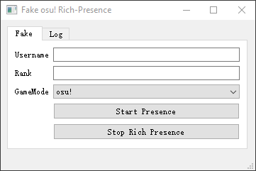

# AquilaRP

> A python script that provides a Discord Rich Presence description for osu! but it's AQN.

 

## Hows it Work

Get the current game activity through the process title of `osu!.exe`.

It gets the process title every three seconds, but the occupancy rate in the background is low enough to be ignored.

## Stuff is good, but why

Some people want to show their Rich-Presence but dont want to get a report for it. But at the same time, they still want to let their friends know what they are doing instead of telling the kids that their username is used for reporting. AquilaRP is for them.

# What will it display

AquilaRP will not display any ign, only show the beatmap you are currently playing or editing, and which player is spectating by you.
# Preview

## Fake real osu! Rich-Presence

| State | Real | Fake |
|:--:|:-:|:-:|
| Idle/AFK |  |  |
| In game |  |  |
| Editing (delete) |  |  ||

## Surface

| Preview |
|:--:|
|  |

# How to use

- Download compiled file in [Release](https://github.com/Kotoki1337/AquilaRP/releases).
- Put it where you cant forget (I dont care you putting **AquliaRP** next to **AQN** LOL).
- Open it and forget it.

## Building from Source

Don't want to use my client id? Build AquilaRP from source fairly easily.

Prerequisites:
- [Python 3.8.2](https://www.python.org/)
- [pypresence](https://github.com/qwertyquerty/pypresence)
- [pygetwindow](https://github.com/asweigart/PyGetWindow)
- [pyinstaller](https://pypi.org/project/PyInstaller/) (You can get this using `pip install pyinstaller`)

**Windows**

1. Any `clone` method you want to use
2. Make you own big brain code here.
3. Open `cmd` and run `pyinstaller -F main.py` in main folder.

**Linux**

I don't use Linux. If you are all using Linux, building python should not be difficult for you

# WIP
- [ ] Support AQN replay editor.
- [x] Identify in-game beatmap edit.
- [x] Custom text.
- [x] Disable display server.
- [x] Python GUI
